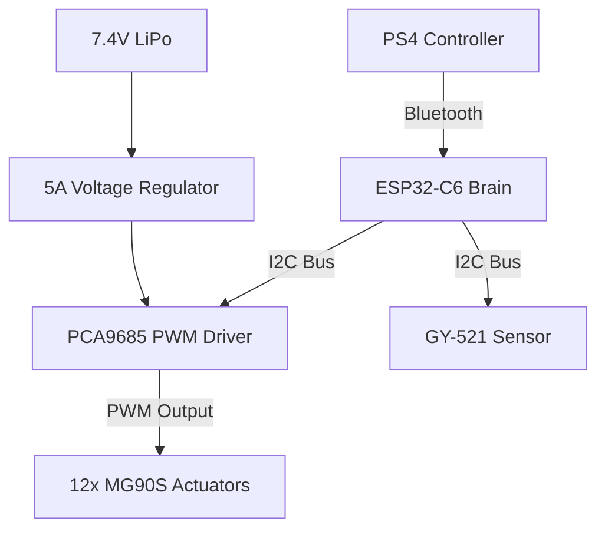

# Arttous: Autonomous Quadruped Platform

**Arttous** is a high-performance, open-source quadruped robot engineered for agile locomotion across unstructured terrain. Designed with both precision and accessibility in mind, the platform combines **Inverse Kinematics (IK)**, high-torque **metal gear servos**, and robust sensor fusion to execute complex behaviors such as autonomous exploration, terrain stabilization, and safe return navigation.

Unlike traditional wheeled rovers, Arttous employs **12 Degrees of Freedom (DOF)** to step over obstacles, maintain balance on uneven surfaces, and operate in confined or unpredictable environments.

---

## 🚀 Key Features

* **Precision Kinematics**
  Custom Inverse Kinematics engine running on the **ESP32-C6**, enabling organic gait generation, smooth transitions, and dynamic body leveling.

* **High-Torque Articulation**
  12× **MG90S Metal Gear Servos** (3 per leg) provide durability, load tolerance, and sub-millimeter positioning accuracy.

* **Zero-Latency Teleoperation**
  Native **PS4 DualShock 4** Bluetooth control for responsive, tactile real-time operation.

* **Autonomous Path Memory (T3S3 Logic)**
  The robot continuously records movement waypoints. If communication is lost, Arttous automatically retraces its path to the last known safe position.

* **Active IMU Stabilization**
  Real-time orientation correction using the **GY-521 (MPU-6050)** to keep the chassis level on slopes and uneven terrain.

---

## 🛠 Hardware Architecture

The Arttous platform evolved from early DC motor concepts into a clean, scalable **I²C-based digital architecture**, improving reliability, timing accuracy, and cable management.

### Core Components

| Component           | Specification                   | Function                                                                                |
| ------------------- | ------------------------------- | --------------------------------------------------------------------------------------- |
| **Microcontroller** | **ESP32-C6-DevKitC-1-N8**       | Central controller handling IK computation, Bluetooth communication, and sensor fusion. |
| **Actuators**       | 12× **MG90S Metal Gear Servos** | Leg articulation (“muscles”); 3 servos per leg for 12 DOF.                              |
| **Servo Driver**    | **PCA9685 (16-Channel)**        | Hardware PWM generator; offloads timing-critical servo control via I²C.                 |
| **IMU Sensor**      | **GY-521 (MPU-6050)**           | 6-DOF accelerometer and gyroscope for balance and orientation feedback.                 |
| **Power System**    | **5A UBEC (DC–DC)**             | Regulates 7.4V LiPo input to a stable 5V/6V rail for servos.                            |

---

### Signal Flow Diagram



---

## 🔌 Wiring & Connectivity

### I²C Bus Configuration (ESP32-C6)

The **PCA9685** servo driver and **GY-521** IMU operate on a shared high-speed I²C bus.

| ESP32-C6 Pin | Connection | Description             |
| ------------ | ---------- | ----------------------- |
| **GPIO 6**   | SDA        | Shared I²C data line    |
| **GPIO 7**   | SCL        | Shared I²C clock line   |
| **3.3V**     | VCC        | Logic-level power only  |
| **GND**      | GND        | Common ground reference |

> **Important:** Servos must be powered exclusively through the PCA9685 high-current terminal block via the UBEC. Never power servos directly from the ESP32.

---

## 📂 Project Structure

```text
/
├── docs/
│   ├── tera/                # Public-facing website (HTML templates)
│   │   ├── index.html       # Landing page
│   │   ├── about.html       # Project evolution & vision
│   │   ├── technology.html  # Hardware and IK deep dive
│   │   ├── investors.html   # Roadmap and market positioning
│   │   └── contact.html     # Communication hub
│   │
│   ├── bono/                # Static assets
│   │   ├── css/             # Custom dark-theme stylesheets
│   │   ├── js/              # Animations and interactivity
│   │   ├── images/          # Renders, diagrams, and logos
│   │   └── fonts/           # Soria font assets
│   │
│   └── blender/             # Mechanical CAD resources
│       └── robo-model.blend # 1:1 scale, 3D-printable source
│
├── firmware/                # ESP32-C6 C++ firmware
└── README.md                # Project documentation
```

---

## 💾 Installation & Setup

### Web Documentation

To host the documentation and portfolio site locally:

```bash
cd docs/tera
python3 -m http.server 8000
```

Open your browser and navigate to:

```
http://localhost:8000/index.html
```

---

### Firmware Deployment

1. Open the project in **Visual Studio Code** with the **PlatformIO** extension installed.
2. Select the `esp32-c6-devkitc-1` environment.
3. Install required libraries:

   * Adafruit PWM Servo Driver
   * Adafruit MPU6050
   * PS4Controller
4. Connect the ESP32-C6 via USB.
5. Build and upload the firmware.

---

## 🎮 Operation & Controls

1. **Standby**
   Connect the 7.4V LiPo battery. Arttous initializes and moves to a neutral standing pose.

2. **Controller Pairing**
   Hold **Share + PS Button** on the DualShock 4 until the light bar flashes.

3. **Control Mapping**

   * **Left Joystick:** Forward / backward movement and strafing
   * **Right Joystick:** Yaw (rotation) and pitch (body tilt)
   * **L1 / R1:** Body height adjustment
   * **Triangle Button:** Activate **Autonomous Return Mode** (T3S3 Safe Mode)

---

## 📜 License & Status

Arttous is an **open-source experimental robotics platform** under active development. Hardware, firmware, and mechanical designs are evolving as the project advances toward higher autonomy and terrain intelligence.

Contributions, experimentation, and educational use are encouraged.

---

**Arttous** — engineered to walk where wheels fail.
